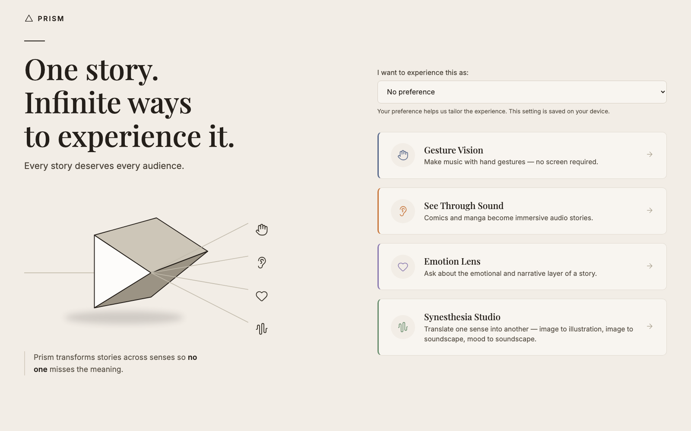
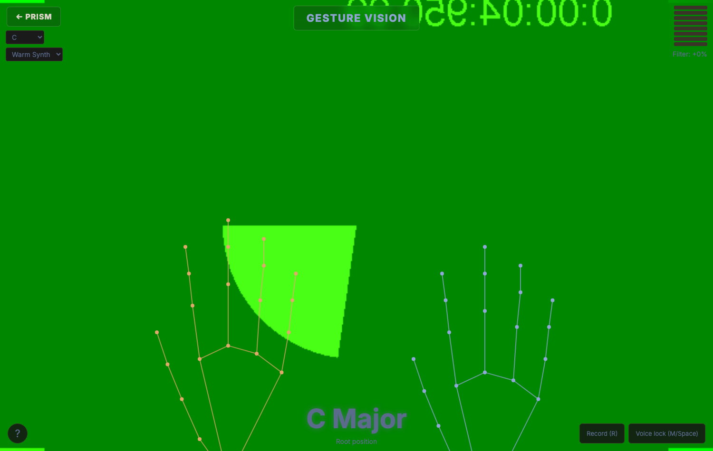
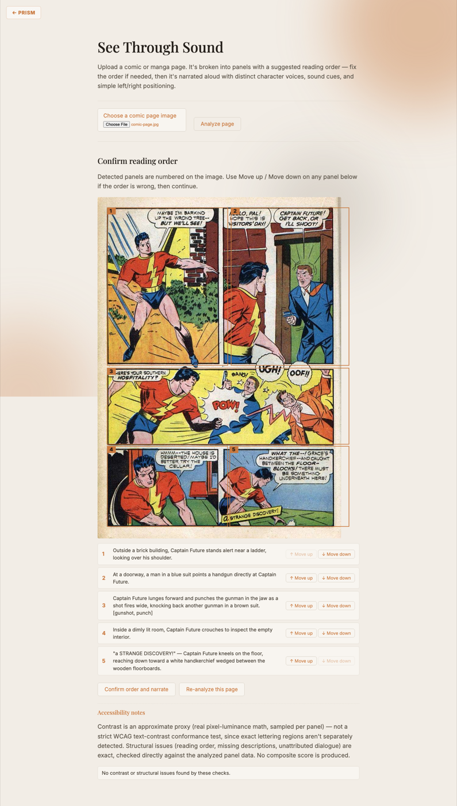
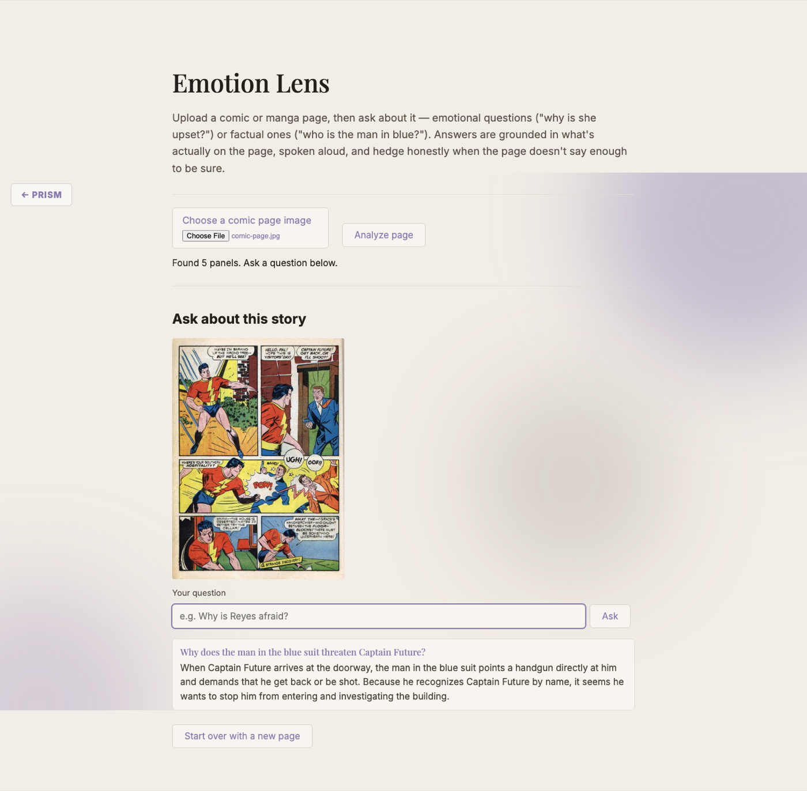
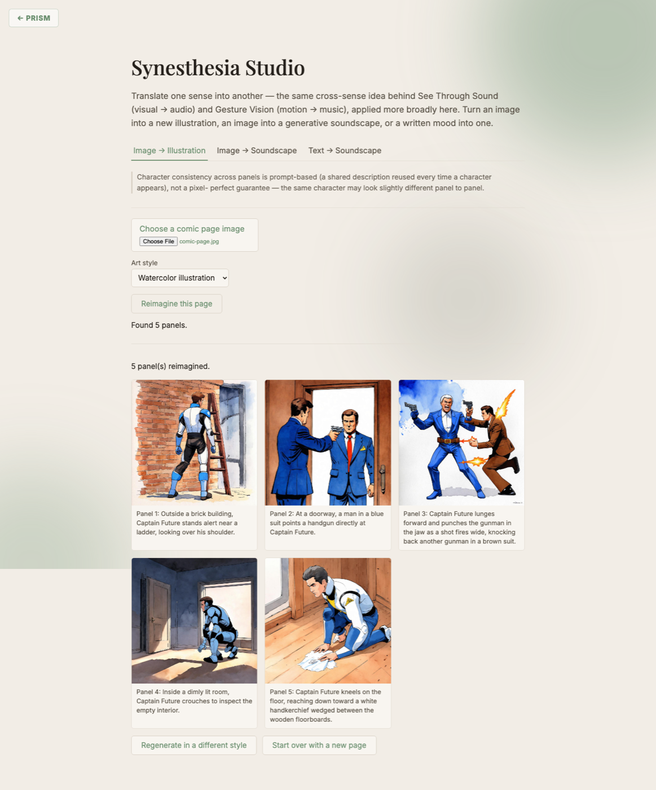

# Prism

*One story. Infinite ways to experience it.*

Prism is an accessibility-first creative platform that translates stories and artistic experiences across senses. Readers can hear comics as immersive audio dramas, explore emotional meaning through grounded AI Q&A, create and experience music without a visual interface, and transform images, text, and sound into new creative forms. Rather than generating more content, Prism focuses on making creative experiences accessible to more people.



## Problem

Existing accessibility tools for visual storytelling — alt text, flat image
captions — communicate facts about a scene without preserving its atmosphere,
pacing, tension, or artistic intent. The story gets flattened into
information. Separately, creative tools like musical instruments assume
sighted access to a visual interface (a keyboard, a DAW, sheet music),
excluding blind and low-vision musicians from an entire mode of creative
expression.

## Solution

Prism is a suite of standalone, selectable accessibility-first
creative experiences — not one compiled pipeline, but several independent
modes a user picks from:

- **Gesture Vision** — play music with hand gestures
  alone, no visual interface required.
- **See Through Sound** — comics and manga become immersive
  audio stories: narration, distinct character voices, sound effects, and
  ambience, grounded in the actual page rather than a generic caption.
- **Emotion Lens** — a narrative-understanding layer,
  exposed through Q&A, for emotional subtext, motives, and relationships a
  story never states outright.
- **Synesthesia Studio** — translates one sense into
  another: a comic panel into a new illustration, an image into a
  generative ambient soundscape, or a written mood into one.

Cutting across all four: **Creative Access Mode**, a single shared
preference (not a separate mode or page) that adapts every mode's
behavior to how you're actually experiencing it — blind, low-vision,
dyslexic, deaf/hard-of-hearing, or motor-impaired. See below.

## Who this is for

- **A blind or low-vision reader** — See Through Sound turns a comic page
  into narration, distinct voices, and sound effects; Emotion Lens lets them
  ask about it in plain language and hear a grounded answer back.
- **A blind musician** — Gesture Vision is a full instrument playable by
  hand shape and motion alone, with spoken confirmation of the one thing
  that can't be inferred from the sound itself (chord/quality changes).
- **A deaf or hard-of-hearing reader** — every mode already shows a full
  text equivalent alongside its audio; sound effects render as bracketed
  captions (`[gunshot, punch]`) instead of being audio-only.
- **A dyslexic reader** — Creative Access Mode swaps in a plainer font,
  more line/letter spacing, and a bounded line length, without pretending a
  specific "dyslexia font" is a cure for something the evidence doesn't
  support.
- **A motor-impaired user** — larger click targets and spacing on every
  control, everywhere, from a single preference instead of five different
  settings screens.
- **Anyone curious, disability or not** — Synesthesia Studio is a genuine
  creative tool on its own terms: reimagine a page as a new illustration,
  or turn any image or mood into a generative soundscape.

## Design decisions

A few honest notes on why Prism ended up looking like this, rather than
something else.

**Why not another AI story generator.** My first instinct was some version of "type a prompt, get a story back." The more I
looked around, the more that exact shape kept showing up — story
generators, screenplay generators, campaign generators, one AI wrapper
after another producing new content on demand. That's a legitimately useful
thing to build, but it wasn't the thing I actually cared about. The
question I kept returning to wasn't "how do we make more stories," it was
"who's currently locked out of the stories that already exist." That's a
different problem, and it's the one Prism is actually trying to solve.

**Why there's no accessibility score.** Early on I sketched a feature that
would output something like "Accessibility Score: 78/100" for any uploaded
page — it demos beautifully. It also isn't real. No model can honestly
produce that number without a validated methodology behind it: real outcome
data from real blind, low-vision, and neurodiverse readers, collected over
time. I don't have that, and pretending otherwise felt like exactly the
wrong instinct to build into an *accessibility* tool of all things. So
Prism only ever surfaces two kinds of findings: things that are genuinely,
deterministically computable (real WCAG contrast math on real pixels,
structural facts checked directly against the analyzed page), and it says
so plainly when it's just an approximation rather than a certified test.
Nowhere in this project does a number get invented to sound more confident
than the underlying evidence actually supports.

**Why four small modes instead of one big pipeline.** It would have been
easy to chain everything into a single "upload once, get everything"
mega-flow. I chose the opposite: four independent, standalone experiences
that each have to work completely on their own, because a person using
Prism might only ever need one of them — a blind musician doesn't need a
comic-narration feature, a low-vision reader doesn't need hand-gesture
music. Depth in a few honestly-scoped things over breadth in one
overextended thing.

**How this was built.** IBM Bob was the primary development tool
throughout — used to brainstorm and shape the initial concept, work
through technical design questions as they came up, and plan the project's
scaffolding and architecture before implementation began. The actual
build — the cascade design, the honesty-first accessibility report, all
four modes — was carried out from that initial direction.

## Gesture Vision — how it works

Left hand: number of fingers extended selects a scale degree (I-V); the
index+pinky and index+pinky+thumb shapes give VI and VII. Tilting the left
wrist left/right switches major/minor — a dead zone keeps a centered hand
neutral, so there's a stable "home" position to return to by feel.

Right hand: finger count (0-4) selects chord quality/inversion, thumb
extended drops an octave, hand height controls volume, and hand tilt sweeps
a tone filter.

Chord and quality changes are spoken aloud automatically — that's the one
thing a blind player can't infer from the sound alone. Volume and filter
brightness are *not* announced: they're continuous, and the sound itself
already carries that information, the same way a sighted player reads them
by ear rather than by watching a meter.



The design goal is not to describe the instrument, but to make it playable without requiring sight. Discrete state changes such as chord, scale degree, and quality are surfaced through spoken confirmation because they are otherwise invisible to a blind performer. Continuous controls such as volume and timbre are left unannounced, since the sound itself already communicates those changes. The result is a musical interface that can be navigated by listening and performing, rather than by monitoring a visual display.

## See Through Sound — how it works

Upload a single comic/manga page image. A vision-LLM call (IBM watsonx
Granite Vision, mockable) detects each panel's bounding box, suggests a
reading order, transcribes captions and dialogue, tags a mood per panel,
and tags up to two sound cues from a fixed vocabulary. The reader reviews
the suggested order on an overlay of numbered boxes and can fix it with
keyboard-operable Move up/down controls (no drag-and-drop dependency) before
continuing — panel detection on real, varied page layouts won't always get
reading order right, so this is a required step, not an afterthought.

Once confirmed, a second AI pass reconstructs the flowing narration —
adding brief connective narration between panels and resolving vague
references ("a figure") to a character's name once introduced — without
ever rewriting the actual dialogue or reordering panels itself. Each unique
speaker is assigned one of four fixed character voices (plus a separate
narrator voice), synthesized via IBM Watson Text to Speech with SSML
prosody driven by the panel's tagged emotion (afraid, urgent, relieved,
etc.) — deliberately a fixed voice pool with simple prosody rules, not a
bespoke "personality engine," and no attempt at re-identifying characters
across chapters or art styles. Sound cues are synthesized procedurally via
Web Audio (rain, thunder, footsteps, a heartbeat, and so on) rather than
pulled from a real sound-effect library, so there's no licensing risk.
Playback pans left/right per panel based on its horizontal position on the
page — simple rule-based stereo positioning, not true 3D spatial audio.

**Accessibility report** (shown alongside the reading-order review, real
analysis only — see the Accessibility report section below for why): real
pixel-level contrast math per panel, plus checkable structural facts drawn
directly from the analyzed panel data (ambiguous/incomplete reading order,
panels with no description, dialogue with no attributed speaker).
Deliberately no composite "accessibility score" — see Design decisions
above for why.

This screenshot is a real run against an actual public-domain Golden Age
comic page (*Startling Comics* #10, 1946 — via Wikimedia Commons), not a
mock: five real detected panels, a real reading order, and real tagged
sound cues (`[gunshot, punch]`) shown as bracketed captions.



## Emotion Lens — how it works

Upload a page (reusing the same panel-analysis pipeline as See Through
Sound) and ask about it in plain language — emotional questions ("why is
she upset?") or factual ones ("who is the man in blue?"). Answers are
grounded in a structured "story bible" built from the analyzed panels — a
per-panel summary plus a per-character index of every line they speak,
their tagged emotion, and which panel it's in — rather than an LLM just
re-reading a wall of raw text each time. Answers are required to distinguish
what the page actually states from what's inferred, cite the specific
dialogue or action an inference is based on, and hedge honestly ("it seems,"
"this suggests") instead of asserting a guess as fact or attaching a
fabricated confidence number — grounded in the same real audio-description
and literary-analysis principles used throughout Prism, not an ad hoc
prompt. Answers are read aloud, not just displayed, since this is meant to
be used by ear.

A real question against the same real analyzed page — the answer cites
what's actually shown (the gun, the demand to "get back") rather than
inventing a motive the page never states:



## Synesthesia Studio — how it works

Cross-sense translation is already Prism's core mechanic — See Through
Sound turns *visual → audio*, Gesture Vision turns *motion → music*.
Synesthesia Studio makes that the explicit point, with three modes sharing
one page:

- **Image → Illustration**: upload a comic page, pick an art style, and
  each panel is regenerated as a new illustration in that style — grounded
  in the panel's actual scene description, not a generic prompt. Before
  generating, a per-character visual description (hair, clothing, build —
  only what the page actually establishes, nothing invented) is extracted
  once and reused in every panel that character appears in, so the same
  character stays as consistent as prompt-level description can make them.
  This is **not** IBM tooling: watsonx has no image-generation model at
  all, on any plan, in any region (confirmed directly against the API, not
  assumed) — the challenge's own rules explicitly welcome "additional
  technologies and frameworks," and image generation via Hugging Face's
  free `hf-inference` provider (Stable Diffusion 3 Medium) is the one piece
  of Prism that isn't IBM-only. Worth being upfront about the honest limits
  here: this is prompt-based consistency, not a per-character fine-tune or
  locked seed — the same character can look slightly different panel to
  panel, which is a real, known constraint, not something this approach
  fully solves.
- **Image → Soundscape**: upload any image — not just a comic panel, any
  photo or painting — and a vision-LLM call extracts a continuous
  emotional/atmospheric profile (brightness, energy, warmth, valence, each
  0–1) rather than a discrete tag. That profile drives a generative ambient
  pad synth (layered detuned oscillators, mood-driven filter cutoff, LFO
  movement tied to energy) built entirely in Web Audio — no audio assets,
  no external synthesis API. Because the sound generation itself is 100%
  procedural, the output is always real audio, even on the mock-fallback
  path — only the mood's *accuracy* changes, never whether it makes sound.
- **Text → Soundscape**: the same mood-extraction and synth engine, driven
  by a typed description instead of an image — "a quiet, misty forest at
  dawn" and "a stormy night at sea" produce audibly, meaningfully different
  soundscapes, not just different labels.

A real run of Image → Illustration against the same real comic page, in the
watercolor style — five distinct real illustrations, each grounded in its
own panel's actual scene description (note the hero and the antagonist are
correctly rendered as two different people throughout).



## Creative Access Mode — how it works

Select "Experiencing this as: blind / low-vision / dyslexic / deaf /
motor-impaired" once, on the landing page — it's stored on-device
(`localStorage`, nothing sent to a server) and read by every mode, so one
choice changes behavior everywhere instead of five separate settings
screens. Deliberately modest, real adaptations rather than a vague
"personalizes everything" claim:

- **Low vision**: larger base text, boosted contrast on secondary/muted
  text that's intentionally dim by design in the dark theme (exactly the
  text a low-vision user is least able to read), thicker control borders.
- **Dyslexic**: more line-height and letter-spacing, a plain sans-serif in
  place of the monospace font used elsewhere, left-aligned text with a
  bounded line length. Deliberately *not* claiming a specific "dyslexia
  font" fixes reading — the evidence for that is weak/contested — just the
  broadly-agreed, uncontroversial basics.
- **Deaf / hard of hearing**: transcript and conversation text rendered
  larger and more prominent (every mode already shows a full text
  equivalent alongside its spoken audio; this just emphasizes it).
- **Motor impaired**: larger click targets and button spacing across every
  control.
- **Blind**: focus automatically moves to the first actionable control on
  page load, skipping the need to Tab past intro text — with one explicit
  override: on Gesture Vision specifically (the mode built for blind
  musicians), focus goes to the Start control rather than the key/tone
  selectors that happen to appear first in the page's markup.

This is a real, if intentionally narrow, answer to "personalized creative
assistant" — one of the challenge's own named solution areas that none of
the other 4 modes address on its own.

## Accessibility report — how it works

Shown automatically alongside See Through Sound's reading-order review,
whenever real (non-mock) panel analysis succeeds. Two kinds of findings,
both genuinely computed — no AI model, no invented score:

- **Approximate visual contrast per panel** — real pixel math (the WCAG
  relative-luminance formula, applied to actual sampled pixels within each
  panel's detected bounding box). Deliberately *not* called "WCAG
  text-contrast conformance": that standard applies to specific
  text-on-background pairs with known locations, and this pipeline doesn't
  separately detect where lettering sits on the page — this measures
  overall light/dark separation within each panel as an honest, disclosed
  proxy, not an oversold claim of formal conformance.
- **Structural issues** drawn directly from the already-analyzed panel
  data: ambiguous or incomplete reading order, a panel with no scene
  description, a dialogue line with no attributed speaker. Real, checkable
  facts, not estimates.

**Why there's no "Accessibility Score: 72/100."** Covered fully under
Design decisions above — in short, no validated methodology exists for a
number like that, so this project doesn't invent one. Worth adding here:
this report only ever runs on real panel analysis, not the mock fallback —
the mock story's bounding boxes are a fixed generic grid with no
correspondence to an actual uploaded image's real layout, so computing
contrast against them would be real math applied to meaningless regions.

**Two things the report doesn't just detect — it fixes.** Sound effects
(`gunshot`, `thunder`, etc.) used to be audio-only, synthesized by the
Web Audio SFX engine with no visible equivalent anywhere — a deaf or
hard-of-hearing reader following the transcript would silently miss any
panel whose meaning depended on one. They're now shown as a bracketed
caption (`[rain, thunder]`), the standard closed-captioning convention,
in both the pre-narration panel review and the playback transcript — not
just reported as a gap, actually closed. And when a panel is flagged
low-contrast, a "Generate high-contrast version" button runs a real
per-channel histogram-stretch (find the actual darkest/lightest pixel
values across the whole image, linearly remap every pixel to use the
full 0–255 range) entirely in the browser via Canvas — genuine,
deterministic contrast enhancement, not an AI-generated "enhanced"
image.

## Architecture notes

### IBM technology stack

| Component | Role | Used in |
|---|---|---|
| IBM Bob | Primary development tool — brainstorming and ideation, technical design discussion, and planning the project's scaffolding and architecture before implementation began | Project planning, throughout |
| `ibm/granite-3-8b-instruct` via watsonx.ai | Narrative reconstruction, Emotion Lens Q&A, character-sheet extraction, mood extraction — every text-only AI pass | See Through Sound, Emotion Lens, Synesthesia Studio |
| Vision-capable model via watsonx.ai (`meta-llama/llama-3-2-11b-vision-instruct` — Granite Vision isn't available on this account tier; see Design decisions) | Comic panel detection, reading order, transcription | See Through Sound, Emotion Lens, Synesthesia Studio (one shared analyze call) |
| IBM Watson Text to Speech | Narration voices and spoken Q&A answers | See Through Sound, Emotion Lens |
| watsonx tried first, always | Every real AI call site attempts watsonx before any fallback — not just "available," the default | Whole backend, via `shared/cascade.js` |
| *Disclosed non-IBM fallbacks:* Google Gemini (automatic, on watsonx failure/quota exhaustion), Hugging Face Stable Diffusion 3 Medium (image generation — watsonx has no image-gen model at all), Ollama + macOS `say` (zero-quota local fallback) | Resilience layers and one genuine capability gap, not a preference over IBM | See the cascade explanation below and Design decisions above |

**Three-tier provider cascade.** Every AI call site (panel analysis,
narrative reconstruction, character-sheet extraction, Emotion Lens Q&A,
Synesthesia's mood extraction, and TTS) tries whichever provider is
configured as primary, then falls through the other real providers in a
fixed order, and only then falls back to a mock — never straight from one
failure to a placeholder. The third rung, `local`, runs entirely on-device
via [Ollama](https://ollama.com) (vision: llava; text: llama3.2:1b)
and macOS's built-in `say` (TTS) — no API key, no billing, no rate limit,
so it's the one option that can never run out mid-demo the way watsonx's
300k-token/month cap and Gemini's 20-request/day free tier both did during
development. Honest tradeoff: local models are meaningfully weaker and
much slower than the cloud providers — llava takes roughly 60-90 seconds to
analyze a comic page (vs. a few seconds for watsonx/Gemini); a smaller,
faster model (moondream) was tried first and reliably failed to produce
valid JSON against the full structured schema, so llava is the default
despite the latency cost. Tested side by side specifically on the tasks
where instruction-following matters most: llama3.2:1b readily fabricated
unstated backstory on Emotion Lens's grounded Q&A and invented new visual
details during narrative reconstruction (both explicitly disallowed by
their prompts) where llama3.2:3b did meaningfully better, though not
perfectly — smaller local models are just weaker at instruction-following
than the cloud providers, a real, disclosed limitation, not papered over.

**Citation guard.** Emotion Lens's Q&A is built around "cite evidence,
hedge honestly, never invent unstated backstory" (`rag/narrativeGuidelines.md`)
— but until now that was enforced entirely by *asking the model nicely* in
the prompt. `emotionLens/citationGuard.js` turns that into a code-level
check: any text an answer puts in quotation marks is verified against the
actual story bible it was grounded on. A model that paraphrases without
quoting is fine — that's expected, encouraged behavior. A model that quotes
something that was never actually said gets one corrective retry; if the
citation still can't be verified, the UI surfaces an explicit caveat rather
than silently trusting the model's word for it.

**Automated tests.** Two suites:
- `backend/test/` — a Vitest suite (72 tests) covering the citation guard,
  the cascade ordering logic, provider validation/normalization logic
  (mood clamping, panel-shape validation, SFX vocabulary filtering), the
  accessibility report's contrast math and structural checks (including a
  real pixel-decode test against a synthetic black/white image), and two
  integration tests exercising the real fallback/retry wiring through
  actual provider modules (a forced watsonx→gemini→local cascade, and the
  citation guard's retry-then-warn flow) with only the local provider's
  network call stubbed — deterministic, no live API or running Ollama
  needed. `npm test` from `backend/`.
- `e2e/` — a Playwright suite (21 tests) covering all 4 modes end to end
  (upload → analyze → interact, cross-tab state, home navigation), Creative
  Access Mode (profile persistence across pages, the Gesture Vision focus
  override), the accessibility report's frontend rendering, the visible
  SFX captions, and the high-contrast button (via route interception,
  since the mock-forced test backend never populates a real accessibility
  report itself) — against dedicated test instances of the backend/frontend that
  always force every provider to `mock`, regardless of what's in
  `backend/.env`, so the suite is free, fast, and deterministic on any
  machine, never dependent on real credentials, quota, or Ollama being
  installed. `npm test` from `e2e/` (first run: `npm install && npx
  playwright install chromium`).

### Data sources

| Source | What | License |
|---|---|---|
| *Startling Comics* #10, page 28 (1946), via [Wikimedia Commons](https://commons.wikimedia.org/wiki/File:Startling_Comics_10_page_28.jpg) | The comic page used in this README's real screenshots | Public domain (US, published 1931–1963, copyright not renewed) |
| Stable Diffusion 3 Medium (Stability AI) | Image generation for Synesthesia Studio's Illustration mode | Served via Hugging Face's hosted `hf-inference` API |

## Selected challenge theme

July Challenge — Reimagine Creative Industries with AI. Prism is positioned
as both a creative-industries platform (new ways to *experience* and
*create* within existing and new creative mediums) and an accessibility
platform — not accessibility-only, and not another content generator.

## Running locally

```bash
node frontend/serve.js       # frontend, http://localhost:5174
cd backend && npm install && npm start   # backend, http://localhost:3002 (needed for every mode except Gesture Vision)
```

Open http://localhost:5174 and pick a mode. Gesture Vision needs a webcam.
Every other mode needs the backend running (all providers default to
`mock` — see `backend/.env.example` — so everything works with zero
credentials).

Running the test suites:

```bash
cd backend && npm test        # Vitest unit suite — no server, no credentials needed
cd e2e && npm install && npx playwright install chromium && npm test  # Playwright e2e suite
```

## Walkthroughs

Concrete paths to actually try each mode, not just read about it.

**See Through Sound** — Upload any comic/manga page image → **Analyze
page**. Review the numbered panel overlay and reorder anything wrong with
Move up/down → **Confirm order and narrate** → listen, following the
highlighted transcript. If a panel's contrast is flagged, try **Generate
high-contrast version** underneath it.

**Emotion Lens** — Upload the same (or any) page → **Analyze page** → ask
something the page doesn't state outright ("why is he angry?") and
something purely factual ("who's in the doorway?"). Compare how each answer
is hedged.

**Synesthesia Studio** — Upload a page on the **Image → Illustration** tab,
pick a style, **Reimagine this page**. Then switch to **Text → Soundscape**
and try two very different moods ("a quiet, misty forest at dawn" vs. "a
stormy night at sea") back to back — the audio, not just a label, should
sound different.

**Gesture Vision** — Click to start, allow the camera. Hold up a few
fingers on your left hand for a scale degree, tilt your wrist to switch
major/minor, then bring in your right hand for chord quality and volume.
Watch the on-screen skeleton track both hands independently.

**Creative Access Mode** — On the landing page, set "I want to experience
this as" to **Dyslexic**, then open any mode — the font, spacing, and line
length change immediately and persist as you navigate. Try **Blind** next
and reload a mode page: focus jumps straight to the first actionable
control.

## File structure

```
prism/
  frontend/
    index.html          Mode selector / landing page
    serve.js             Zero-dependency static server
    src/
      shared/
        accessProfile.js       Creative Access Mode: shared preference read by every page
        accessProfile.css       Per-profile adaptations (contrast, spacing, font, click targets)
      modes/
        gesture-vision/
          index.html      Gesture Vision page
          style.css
          main.js         Wiring
          handGestures.js  MediaPipe tracking + gesture classification
          chordSynth.js    Web Audio synth engine
          musicTheory.js   Chord/scale math
        see-through-sound/
          index.html      Upload / reorder / playback page (+ accessibility report)
          style.css
          main.js          Wiring
          player.js         Sequences narration + SFX with stereo panning
          sfxSynth.js       Procedural Web Audio sound effects
        emotion-lens/
          index.html      Upload / Q&A chat page
          style.css
          main.js          Wiring (reuses /api/comic/analyze, then Q&A)
        synesthesia-studio/
          index.html      3-tab page: illustration / image→sound / text→sound
          style.css
          main.js          Wiring for all 3 tabs
          soundscapeSynth.js Generative ambient pad engine (continuous mood → Web Audio)
  backend/
    server.js             Express app
    routes/
      comicAnalyze.js      Phase A: panel detection + transcription + accessibility report
      narrate.js            Phase B: narrative reconstruction + script assembly
      tts.js                 Phase B: speech synthesis
      ask.js                  Emotion Lens: story-bible-grounded Q&A
      reimagine.js             Synesthesia Studio: per-panel image generation
      synesthesia.js            Synesthesia Studio: mood extraction (image or text)
    vision/visionProvider.js   Mock / watsonx / Gemini / local (cascade + retry/fallback resilience)
    narration/                Reconstruction pass + deterministic script/voice/pan assembly
    tts/ttsProvider.js         Mock / IBM Watson Text to Speech / local (macOS `say`)
    emotionLens/
      storyBible.js            Structured per-panel/per-character index for Q&A grounding
      qaProvider.js             Mock / watsonx / Gemini / local Q&A
      citationGuard.js          Code-level check that a quoted answer is grounded in the story bible
    imageGen/
      characterSheet.js         Per-character visual description extraction
      imageProvider.js           Mock / Hugging Face (non-IBM — no watsonx image-gen model exists)
      stylePresets.js             Fixed art-style vocabulary shared with the frontend picker
    synesthesia/
      moodProvider.js            Continuous mood-profile extraction (image or text)
    accessibility/
      contrastChecker.js         Real pixel-luminance contrast math + structural checks — no AI
    shared/
      cascade.js                 N-step ordered fallback helper used by every real provider
      diskCache.js                Generic disk-persisted response cache (protects watsonx's token quota)
      geminiClient.js              Shared Gemini text/vision call helpers (non-IBM fallback)
      localClient.js               Shared Ollama text/vision call helpers (zero-cost, zero-quota fallback)
    rag/                       Audio-description + narrative-analysis methodology corpora
    sfx/sfxVocabulary.js       Fixed SFX tag vocabulary shared with the frontend synth
    test/                      Vitest unit suite (citation guard, cascade, provider validation, accessibility math)
  e2e/                        Playwright end-to-end suite, all 4 modes, mock-forced test backend
    playwright.config.js        Spins up isolated backend (3099) + frontend (5199) test instances
    fixtures/                   Shared test fixture image
    tests/                      One spec file per mode, plus access-profile.spec.js
  README.md
```
